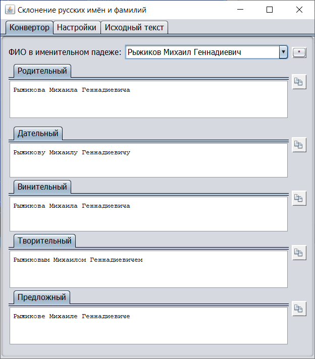

declination-of-russian-names-and-surnames
=========================================

[](http://search.maven.org/#search%7Cga%7C1%7Cg%3A%22com.github.javadev%22%20AND%20a%3A%22declinationofnames%22)
[](https://github.com/javadev/declination-of-russian-names-and-surnames/actions/workflows/maven.yml)

The java/swing application for declination of Russian names and surnames

### Declination of Names Application

The Declination of Names application allows users to generate different grammatical forms of Russian names. It provides a user-friendly interface to input names and view their different declensions.

#### Features

- Generate different grammatical forms of Russian names.
- Copy generated results to the clipboard.
- Save and load previous inputs and results.
- View the source code of the application.

#### Usage

1. Run the application by executing the JAR file.
2. Enter the name in the input field.
3. View the different grammatical forms of the name in the corresponding text areas.
4. Optionally, copy the generated result to the clipboard by selecting the desired form from the dropdown.
5. Close the application to save the current state for future use.

#### Application Controls

- **Input Field**: Enter the Russian name for which you want to generate declensions.
- **Result Text Areas**: View the different grammatical forms of the name.
- **Copy Button**: Copy the selected result to the clipboard.
- **Save Button**: Save the current state of the application.
- **Load Button**: Load a previously saved state of the application.
- **Exit Button**: Close the application.

#### Screenshots

[Add screenshots here if available]

#### Installation

Download the JAR file from [link] and run it using the following command:

```
java -jar declinationofnames.jar
```

#### Credits

This application is developed by [Author Name]. It utilizes [library/tool name] for [purpose].

#### License

[License information]

#### Support

For support or inquiries, please contact [contact information].

#### Contribution

Contributions to this project are welcome. Fork the repository and submit a pull request with your changes.

#### Bug Reporting

To report bugs or suggest improvements, please open an issue on the GitHub repository.

[](https://github.com/javadev/declination-of-russian-names-and-surnames/)
